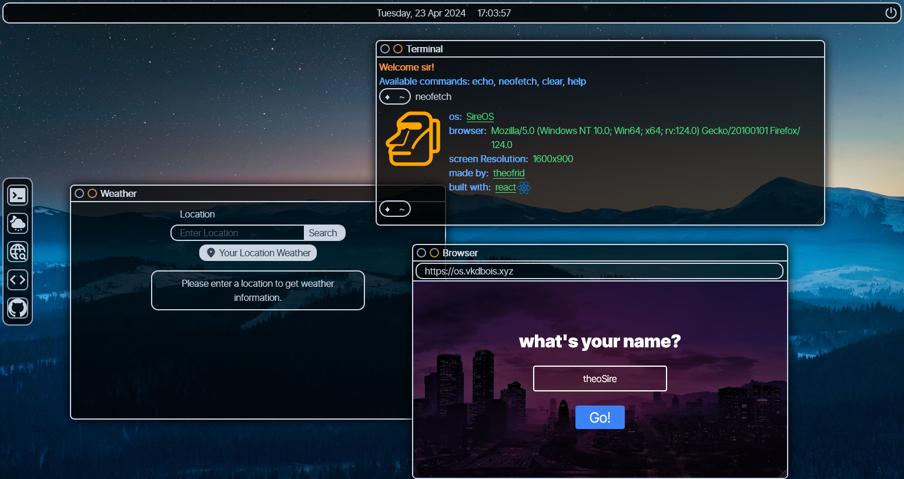

# SireOS

I made a dummy OS as my first React Project.
Hope you guys like it.

Inspired by [TheoIsDumb](https://github.com/TheoIsDumb)'s [TheoOS](https://os.vkdbois.xyz)

## Project Toolkit

- [React](https://react.dev)
- [Zustand](https://github.com/pmndrs/zustand)
- [tailwindcss](https://tailwindcss.com/)
- [@neodrag/react](https://www.neodrag.dev/docs/react)
- [Icônes](https://icones.js.org/)